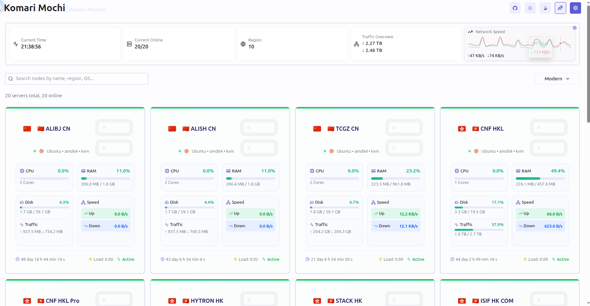
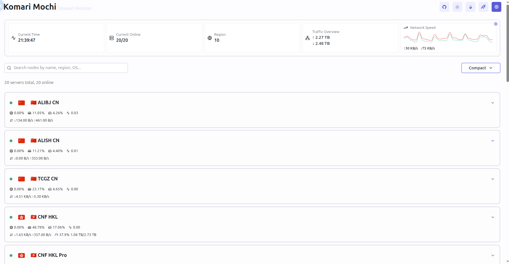
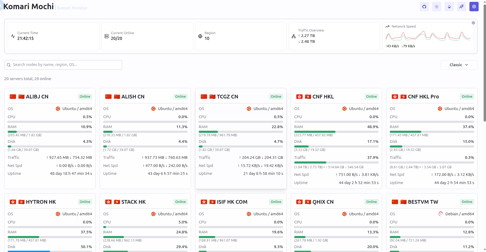
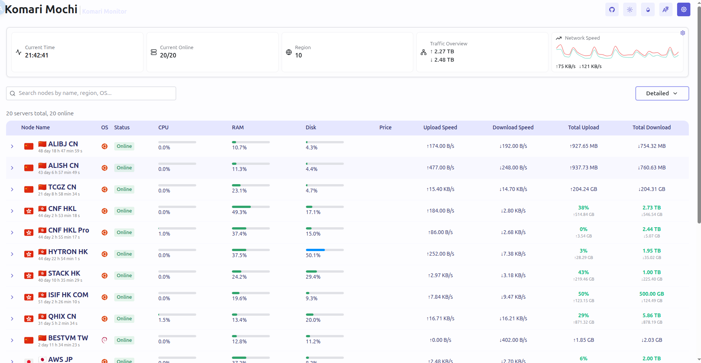
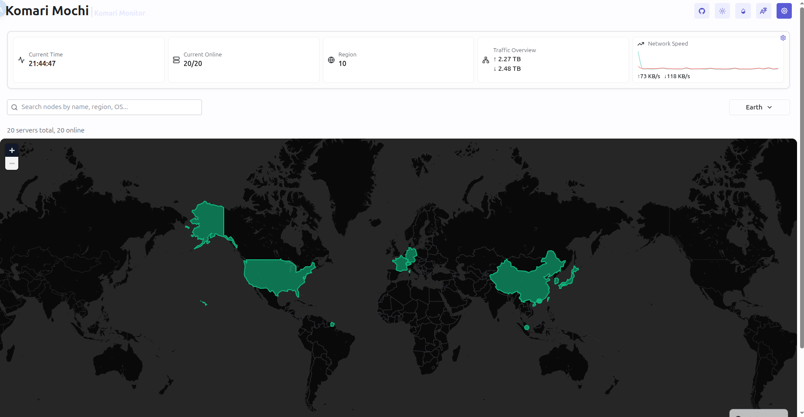

# Komari Web Mochi

[ENG](https://https://github.com/svnmoe/komari-web-mochi/blob/main/README.md)|[中文](https://github.com/svnmoe/komari-web-mochi/blob/main/README_CN.md)

Another theme for [Komari Web](https://github.com/komari-monitor/komari), named Mochi.


## Core Features

1.  Mochi provides 6 switchable node/task views, including Modern, Compact, Classic, Detailed, Task, and Earth modes.
    -   **Modern**: Provides a modern management view for nodes.
        
    -   **Compact**: A compact view designed for quickly browsing through nodes.
        
    -   **Classic**: The official compatible list-style view for node management.
        
    -   **Detailed**: The official compatible table-style view for node management.
        
    -   **Task**: A summarized management view of node load and ping status.
        
    -   **Earth**: A real-time global map view of node statuses.
        
2.  Mochi enhances the UI for pages including, but not limited to, the Node Details and PingChart, and is compatible with both desktop and mobile.
3.  Mochi offers excellent performance and good compatibility. If you experience any lagging issues, please try updating your theme first.

## Quick Start

### 1. Quick Install

1.  Visit our Releases page to [download the latest ZIP file](https://github.com/svnmoe/komari-web-mochi/releases/latest).
    (The filename will be in a format like `komari-theme-v25.08.29-2f2ab2b.zip`)
2.  Log in to your Komari dashboard and navigate to **Settings -> Theme Management**.
3.  Upload the theme's ZIP file and set the theme to Mochi to start using it.

### 2. Build from Source

If you choose to build from source, please ensure you have some basic computer knowledge.

1.  Clone this repository and navigate into the directory:
    ```bash
    git clone [https://github.com/svnmoe/komari-web-mochi.git](https://github.com/svnmoe/komari-web-mochi.git)
    cd ./komari-web-mochi
    ```
2.  Run the build script:
    ```bash
    bash build-theme.sh
    ```
3.  Find the compiled ZIP file, then log in to your Komari dashboard, go to **Settings -> Theme Management**, and upload and enable the theme.

## Contributing

Pull requests and issues are welcome!

## Upstream Project

This project is based on [Komari Web](https://github.com/komari-monitor/komari-web) and created for the [Komari community](https://github.com/komari-monitor/komari).

## Acknowledgements

Special thanks to:

-   The original [Komari Web team](https://github.com/komari-monitor/komari)
-   [Community Contributors](https://github.com/svnmoe/komari-web-mochi/graphs/contributors)

**And to everyone who loves the Mochi theme and Komari**

## License

### MIT LICENSE
```
Copyright <YEAR> <COPYRIGHT HOLDER>

Permission is hereby granted, free of charge, to any person obtaining a copy
of this software and associated documentation files (the “Software”), to deal
in the Software without restriction, including without limitation the rights
to use, copy, modify, merge, publish, distribute, sublicense, and/or sell
copies of the Software, and to permit persons to whom the Software is
furnished to do so, subject to the following conditions:

The above copyright notice and this permission notice shall be included in all
copies or substantial portions of the Software.

THE SOFTWARE IS PROVIDED “AS IS”, WITHOUT WARRANTY OF ANY KIND, EXPRESS OR
IMPLIED, INCLUDING BUT NOT LIMITED TO THE WARRANTIES OF MERCHANTABILITY,
FITNESS FOR A PARTICULAR PURPOSE AND NONINFRINGEMENT. IN NO EVENT SHALL THE
AUTHORS OR COPYRIGHT HOLDERS BE LIABLE FOR ANY CLAIM, DAMAGES OR OTHER
LIABILITY, WHETHER IN AN ACTION OF CONTRACT, TORT OR OTHERWISE, ARISING FROM,
OUT OF OR IN CONNECTION WITH THE SOFTWARE OR THE USE OR OTHER DEALINGS IN THE
SOFTWARE.
```