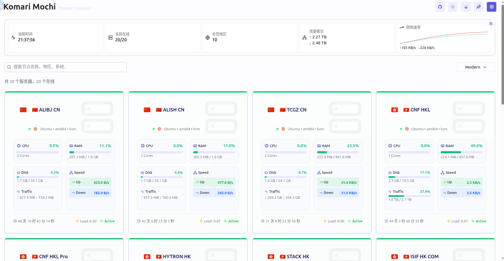

# Komari Web Mochi

基于 [Komari Web](https.github.com/komari-monitor/komari) 的另一个主题 Mochi。


## 核心特性

1.  Mochi 提供 6 种自由切换的节点/任务视图，涵盖 Modern, Compact, Classic, Detailed, Task, Earth 模式。
    -   **Modern**: Modern 模式下提供节点的现代管理视图。
        
    -   **Compact**: Compact 模式下提供节点的紧凑管理视图, 旨在打造快速浏览节点的视图。
        
    -   **Classic**: Classic 模式提供官方兼容的列表式的节点管理视图。
        
    -   **Detailed**: Detailed 模式提供官方兼容的表格式的节点管理视图。
        
    -   **Task**: Task 模式提供汇总的节点负载/Ping 的管理视图。
        
    -   **Earth**: Earth 模式提供全球实时状态的节点地图。
        
2.  Mochi 美化了包括但不限于节点详情页、PingChart 界面，兼容桌面端与移动端。
3.  Mochi 提供了优秀的性能和良好的兼容性，如果您遇到卡顿等问题，请先更新主题。

## 快速开始

### 1. 快速安装

1.  访问我们的 Release 界面，[下载最新的 ZIP 文件](https://github.com/svnmoe/komari-web-mochi/releases/latest)。
    (文件名格式如 `komari-theme-v25.08.29-2f2ab2b.zip`)
2.  登录您的 Komari 后台，选择 **设置 -> 主题管理**。
3.  上传主题的 ZIP 文件，设置主题为 Mochi 即可开始使用。

### 2. 编译安装

如果您选择编译安装，请确保您有一定的计算机基础知识。

1.  克隆本仓库并进入目录：
    ```bash
    git clone [https://github.com/svnmoe/komari-web-mochi.git](https://github.com/svnmoe/komari-web-mochi.git)
    cd ./komari-web-mochi
    ```
2.  执行编译脚本：
    ```bash
    bash build-theme.sh
    ```
3.  自行找到编译出来的 ZIP 文件，然后登录您的 Komari 后台，选择 **设置 -> 主题管理**，上传并启用主题。

## 更新主题

登录您的 Komari 后台，选择 **设置 -> 主题管理**,点击Mochi主题然后一键更新

## 贡献

Pull requests and issues are welcome!

## 上游项目

本项目基于 [Komari Web](https://github.com/komari-monitor/komari-web)，为 [Komari 社区](https://github.com/komari-monitor/komari) 制作。

## 致谢

特别感谢：

-   [原版 Komari Web 团队](https://github.com/komari-monitor/komari)
-   [社区贡献者](https://github.com/svnmoe/komari-web-mochi/graphs/contributors)

**以及一切热爱 Mochi 主题和 Komari 的人**

## 许可证

### MIT LICENSE

```
Copyright <YEAR> <COPYRIGHT HOLDER>

Permission is hereby granted, free of charge, to any person obtaining a copy
of this software and associated documentation files (the “Software”), to deal
in the Software without restriction, including without limitation the rights
to use, copy, modify, merge, publish, distribute, sublicense, and/or sell
copies of the Software, and to permit persons to whom the Software is
furnished to do so, subject to the following conditions:

The above copyright notice and this permission notice shall be included in all
copies or substantial portions of the Software.

THE SOFTWARE IS PROVIDED “AS IS”, WITHOUT WARRANTY OF ANY KIND, EXPRESS OR
IMPLIED, INCLUDING BUT NOT LIMITED TO THE WARRANTIES OF MERCHANTABILITY,
FITNESS FOR A PARTICULAR PURPOSE AND NONINFRINGEMENT. IN NO EVENT SHALL THE
AUTHORS OR COPYRIGHT HOLDERS BE LIABLE FOR ANY CLAIM, DAMAGES OR OTHER
LIABILITY, WHETHER IN AN ACTION OF CONTRACT, TORT OR OTHERWISE, ARISING FROM,
OUT OF OR IN CONNECTION WITH THE SOFTWARE OR THE USE OR OTHER DEALINGS IN THE
SOFTWARE.
```
